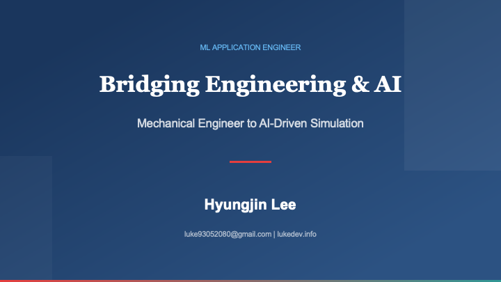
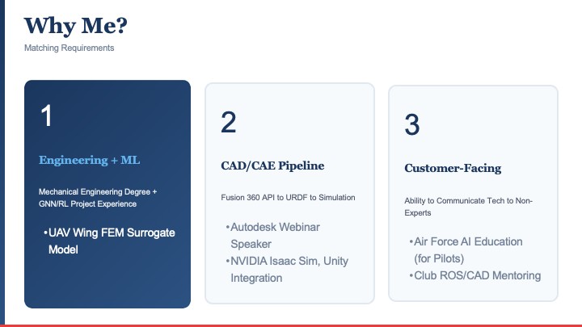
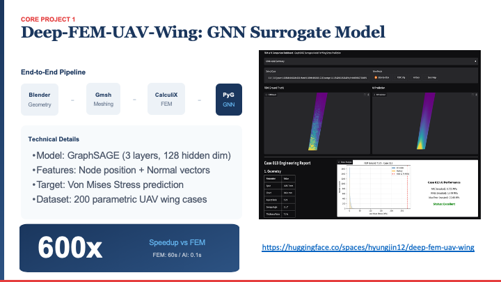
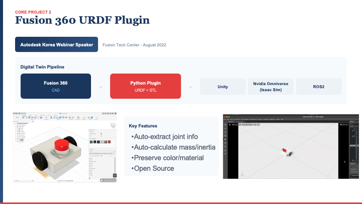
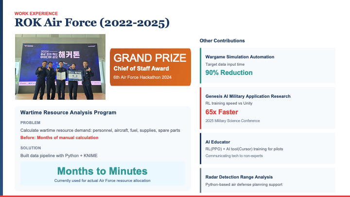
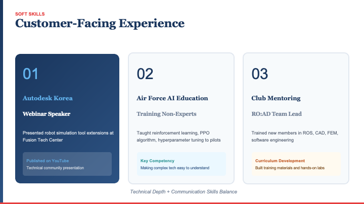
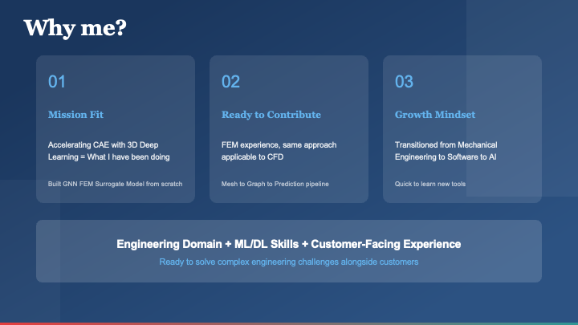

+++
title = "My First Job Interview"
description = "A personal reflection on my first technical interview at a foreign company — lessons learned about preparation, English communication, and humility."
date = 2026-01-16T00:00:00+09:00
draft = false
slug = "my-first-job-interview"
tags = ["Career", "Interview", "Reflection"]
categories = ["Personal"]
+++

> I'm recording this so that when I read it in the future, I can remind myself of this moment.

---

## Why I Applied

After finishing my military service, I wanted to work at a company where I could use English, aiming to study abroad in the US by 2027.

So I applied to a foreign company that combines mechanical engineering with AI. I thought I could leverage both my mechanical engineering background and my AI knowledge. But that turned out to be a big miscalculation.

---

## The Interview Process

### Technical Issues

When I entered the interview, I had prepared a PPT to introduce myself. But due to Mac settings, Teams (which I had just installed) couldn't share my screen. **First mental breakdown.**

They asked me to just explain in English instead. But my English wasn't perfect, and trying to summarize my PPT on the spot was incredibly difficult. I felt my lack of English proficiency acutely.

> **Next time, make sure to check all system settings beforehand.**

### Technical Interview

I somehow got through the basic questions, but I couldn't answer anything in the technical interview. Even though I graduated in mechanical engineering, understanding questions in English was too difficult.

And about AI — I said I had studied it, but thinking about it, with all the "click-and-done" AI tools these days, I had to reflect on whether I actually *knew* anything.

For example, they asked about **Adam**. It was a really basic question. I knew it was basic too, but all I could answer was "it's optimization theory with acceleration added."

There was another technical question that we were supposed to solve together. But I couldn't think of the answer at all, and I wasn't even sure if I understood the question correctly. I tried my best to answer, but it seemed like that wasn't the right answer. The interviewer kept trying to give me hints, but I couldn't pick up on them at all.

Despite everything, the interviewer kept giving hints and explaining things to me. It felt like being a student with a professor. I felt terrible for wasting their time, but they were so kind — they wanted me to understand, so they explained the answer thoroughly until the very end.

> At that moment, I was so embarrassed. My mind went blank. I just wanted it to end quickly.

---

## After the Interview

As it ended, I apologized and honestly told them: "I recently finished military service and wanted to try applying to an English-speaking company. I feel my English is really lacking today."

The interviewer said:

> "Your English isn't lacking. You can communicate with me, right? I don't know what the result will be, but you're young."

---

## What I Learned

It was incredibly lucky to meet such a good interviewer at the first company I applied to, and to gain so much experience from it. Their respectful attitude until the very end was something worth emulating.

I realized I need to study the fundamentals more.

**To-do:**
- Study algorithms
- Study optimizers

---

## To My Future Self

You took on a big challenge today. There will be many difficulties ahead, but always live a life of respect. You'll have more knowledge than you do now, so you'll be cooler, and live a life of helping others.

---

## The PPT I Couldn't Use

