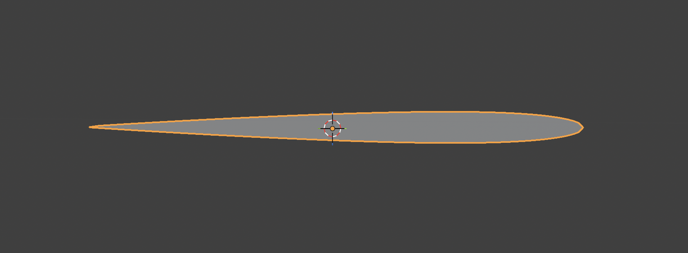
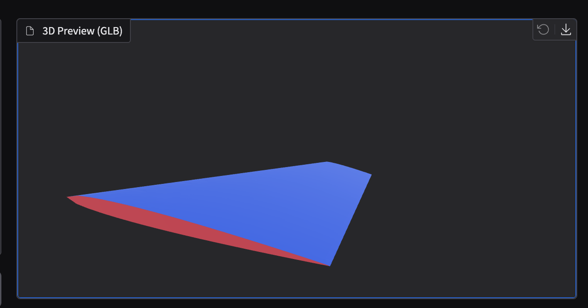
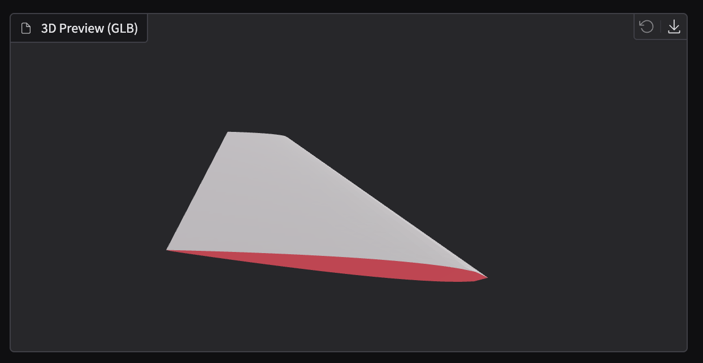
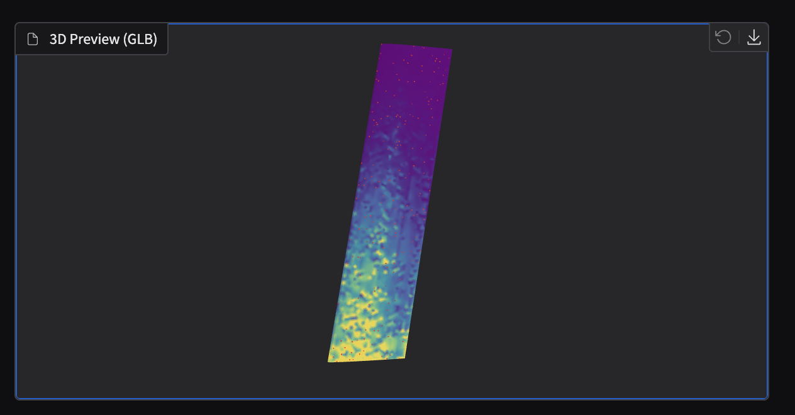
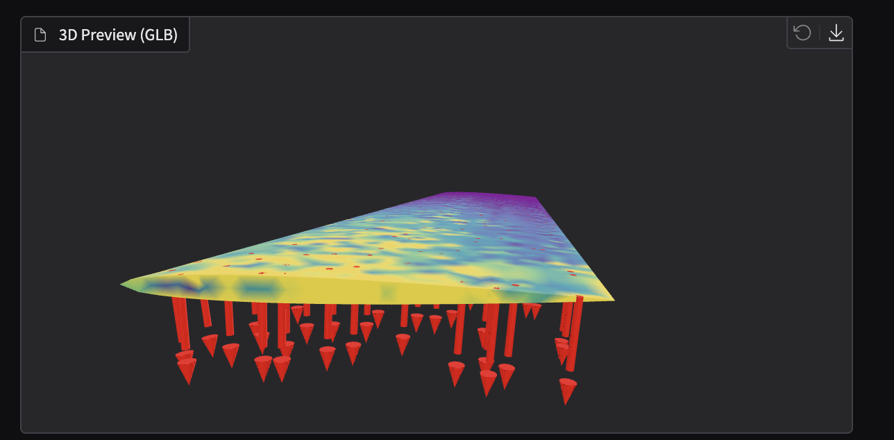
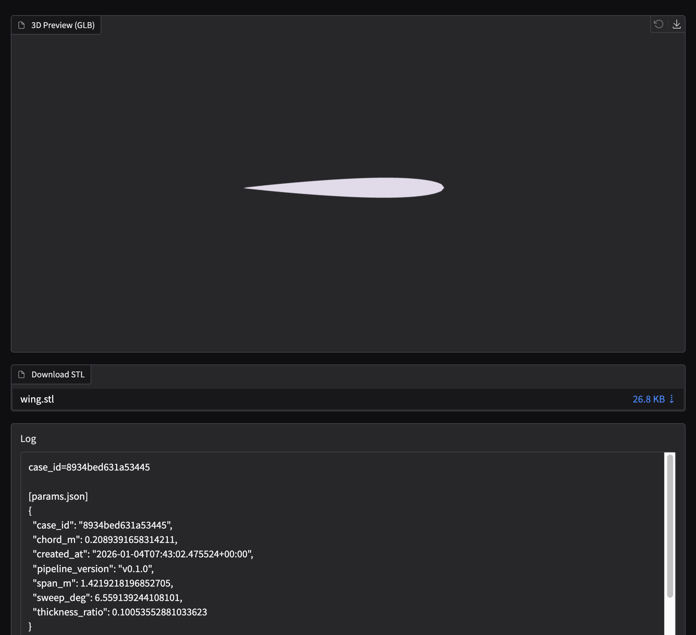

+++
title = "Deep-FEM-UAV-Wing Dev Log (1/2): Geometry → Meshing → FEM"
description = "A practical dev log of an end-to-end pipeline: parametric UAV wing generation in Blender, tetra volume meshing in Gmsh, linear static FEM in CalculiX, and a Gradio viewer for precomputed results."
date = 2026-01-04T00:00:00+09:00
draft = false
slug = "deep-fem-uav-wing-geometry-meshing-fem"
tags = ["FEM", "UAV", "Blender", "Gmsh", "CalculiX", "Gradio", "Simulation"]
categories = ["Simulation"]
image = "pasted-image-20260104220000.png"
+++

> Goal: **Generate 200 parametric UAV wings in Blender**, create **tetrahedral volume meshes** with Gmsh, run **linear static analysis** with CalculiX, and finally **inspect pre-computed results** in a Gradio viewer.

---

## 0-0) 3-minute summary — What did I build?

> I built an end-to-end pipeline that **automatically generates 200 wings (3D)**, **automatically converts them into FEM-ready meshes**, **automatically applies loads and runs analysis**, and then **lets you inspect the results on the web instantly**.

- **(Batch generation)**: Ran Blender in *background mode* to generate **200 wings automatically**. A script replaces what would otherwise be 200 manual UI operations.
- **(FEM preparation)**: Converted the 3D surface (STL) into a FEM-friendly **tetra volume mesh**. In plain terms: turning a “thin shell” into a “solid LEGO block” so structural analysis becomes possible.
- **(Boundary conditions)**: Automatically defined boundary conditions: **root fixed**, **upper surface pressure load**.
- **(Run FEM)**: Executed **linear static FEM** with CalculiX and saved outputs (displacement/stress) per case.
- **(Visualization)**: Built a Gradio UI so that selecting a case immediately shows the **3D result**.

### Results

- **Stage 1 (geometry preview)**: Generated 200 wings and rendered `wing_viz.glb` in Gradio.



- **Stage 2 (Upper/Root debug coloring)**: `surf_sets.glb` shows that Upper/Root are correctly separated.
  - Upper: Blue
  - Root: Red
  - Else: Gray





- **Stage 3 (stress + pressure direction arrows)**: Toggle stress coloring plus sampled pressure direction arrows (200 samples).





---

## 0) Pipeline overview

### Stage 1 — Geometry generation + preview + Gradio viewer

- **What is automated**: Generate **200 wing geometries** and also create preview assets so they can be viewed in a browser immediately.
- **Inputs**: Random/sampled parameters (Span/Chord/Sweep/Thickness)
- **Outputs (per-case folder)**: `data/raw/geometry/{case_id}/`
  - `wing.stl`: surface “shell” for meshing/analysis
  - `wing_viz.glb`: GLB for browser preview
  - `params.json`, `build_report.json`: generation parameters + logs
- **User-visible results (Gradio)**:
  - Select a case and **preview it in 3D immediately**
  - Download `wing.stl`
  - Inspect generation logs

### Stage 2 — Meshing (Gmsh) + boundary set tagging + debug visualization

- **What is automated**: Convert STL into a solid **tetra volume mesh**, and automatically tag surfaces/nodes for boundary conditions (fixed/load areas).
- **Input**: `wing.stl`
- **Outputs (per-case folder)**: `data/raw/mesh/{case_id}/`
  - `wing.msh`: tetra volume mesh
  - `boundary_sets.json`:
    - `NROOT` (fixed root)
    - `SURF_UPPER` (upper surface to apply pressure)
    - `SURF_ALL` (entire skin)
  - `mesh_report.json`: meshing summary
  - `surf_sets.glb`: debug visualization (colored sets)
- **User-visible results (Gradio)**:
  - In **Meshing Debug** mode, you can visually confirm Upper/Root separation

### Stage 3 — FEM (CalculiX) + postprocess + result visualization (stress coloring)

- **What is automated**: Build solver inputs (run `ccx`), then convert results into surface-aligned data + 3D assets.
- **Inputs**: `wing.msh` + `boundary_sets.json` + material props (E, ν) + pressure (p)
- **Outputs (per-case folder)**: `data/raw/fem/{case_id}/`
  - `{case_id}.inp`: CalculiX input (fixed + pressure)
  - `{case_id}.frd`: raw CalculiX result
  - `surface_results.npz`: surface-node aligned data (coords/normals/displacement/stress/masks)
  - `wing_result.glb`: 3D result with stress color
  - (optional) `pressure_vectors.glb`, `wing_result_arrows.glb`: pressure direction arrows (sampled 200)
- **User-visible results (Gradio)**:
  - In **FEM Result**, inspect the stress-colored 3D model
  - Toggle **Show Pressure Arrows** to verify load directions

---

## 0) Python venv is required (avoid PEP 668 issues)

On many systems, installing packages into the system Python is restricted. Use a venv:

```bash
python3 -m venv .venv
source .venv/bin/activate
python -m pip install -r requirements.txt
```

---

## 1) Stage 1 — Generate 200 wings in Blender + STL → GLB + Gradio viewer

### 1-1) Batch generation (STL + GLB)

Generate 200 random airfoil-like wing shapes.

```bash
python scripts/generate_geometry_dataset.py --count 200 --seed 42
```


Outputs (per case):

- `data/raw/geometry/{case_id}/wing.stl`
- `data/raw/geometry/{case_id}/wing_viz.glb`
- `data/raw/geometry/{case_id}/params.json`
- `data/raw/geometry/{case_id}/build_report.json`

Indices:

- `data/raw/geometry/params.csv`
- `data/raw/manifest.json`

### 1-2) Gradio shows an empty GLB viewer (JSON glTF saved with .glb extension)

Symptom: If `wing_viz.glb` is not a binary GLB but a JSON glTF mistakenly saved with a `.glb` extension, Gradio’s `Model3D` may render a blank screen.

Run a repair script to fix existing outputs in bulk:

```bash
python scripts/repair_geometry_glb.py
```



---

## 2) Stage 2 — Meshing (Gmsh) + Boundary Sets + surf_sets.glb debug

### 2-1) Batch meshing

```bash
python scripts/generate_mesh_dataset.py --limit 0
```

Per-case outputs:

- `data/raw/mesh/{case_id}/wing.msh` (tetra volume mesh)
- `data/raw/mesh/{case_id}/mesh_report.json`
- `data/raw/mesh/{case_id}/boundary_sets.json`
- `data/raw/mesh/{case_id}/surf_sets.glb` (debug: Root/Upper visualization)

### 2-2) Boundary set definition (core)

- `NROOT`: node set for fixing the root (default rule: `y <= y_tol`)
- `SURF_ALL`: all exterior faces
- `SURF_UPPER`: subset of exterior faces on the upper surface (pressure load)
- Default rule: `n_z >= nz_min`
- Exclude near-root region (avoid mixing boundary-condition areas)

### 2-3) Debug colors look broken in surf_sets.glb — cause and fix

Problem: If triangle winding / normals are inconsistent, upper-surface classification becomes unstable and the blue/gray coloring looks wrong.

Fix (high-level):

- Run DFS over the triangle adjacency graph (shared edges) to **make winding consistent**
- Stabilize outward normals using `dot(n, C_f - C_vol)` (align outward direction)
- Remove “tiny fragments” in upper candidates by keeping **only the largest connected component**


---

## 3) Stage 3 — FEM (CalculiX) + Postprocess + result GLB (stress) + pressure arrow debug

### 3-1) CalculiX install tip on macOS (Homebrew) — watch the ccx binary name

Homebrew’s `calculix-ccx` may install the solver binary as `ccx_2.22` instead of `ccx`.

```bash
brew tap costerwi/homebrew-calculix
brew install calculix-ccx calculix-cgx
ls -la "$(brew --prefix calculix-ccx)/bin/" | grep ccx
```

### 3-3) Batch FEM execution

```bash
python scripts/generate_fem_dataset.py --limit 0 --pressure 5000
```

Per-case outputs:

- `data/raw/fem/{case_id}/{case_id}.inp`
- `data/raw/fem/{case_id}/{case_id}.frd`
- `data/raw/fem/{case_id}/surface_results.npz`
- `data/raw/fem/{case_id}/wing_result.glb`
- `data/raw/fem/{case_id}/fem_report.json`

### 3-4) Pressure load application — equivalent nodal loads

Pressure on each face is converted into nodal forces and applied via `*CLOAD`.

- Face force:

$$\mathbf{F}_f = p \cdot A_f \cdot (-\hat n)$$

- Distribution: accumulate \(\mathbf{F}_f/3\) to each of the triangle’s three vertices.

> Note: `*CLOAD` **must be inside the `*STEP` block**. If it is outside, CalculiX will error.

### 3-5) Postprocess without ccx2paraview: parse FRD ASCII directly

`ccx2paraview` can be inconvenient to install. If `.frd` is ASCII, you can parse:

- `-4 DISP` section (displacement)
- `-4 STRESS` section (stress)

…and build `surface_results.npz` plus `wing_result.glb` directly.

### 3-6) Pressure direction arrow debug (sample 200)

To verify upper-surface selection and load direction, sample 200 faces from `SURF_UPPER` and draw arrows at face centers.

Generated files:

- `pressure_vectors.glb` (arrows only)
- `wing_result_arrows.glb` (stress + arrows combined)

In Gradio:

- `Preview Mode = FEM Result`
- Toggle **Show Pressure Arrows (sampled)** ON/OFF


---

## 4) Next steps (preview)

- **Stage 4**: Aggregate/validate 200 solved FEM cases automatically (`nan/inf`, scale sanity, failure stats)
- **Stage 5**: Build a surface-graph dataset → train/infer AI
- **Stage 6**: In Gradio, show FEM vs AI side-by-side + error maps + metrics


