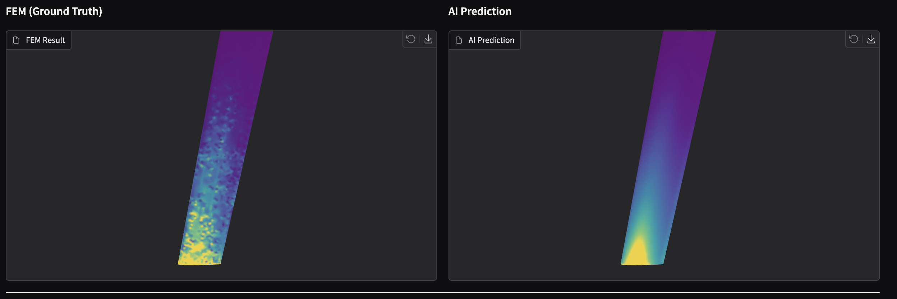
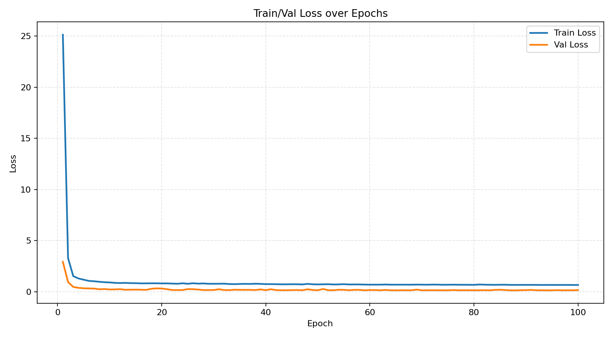
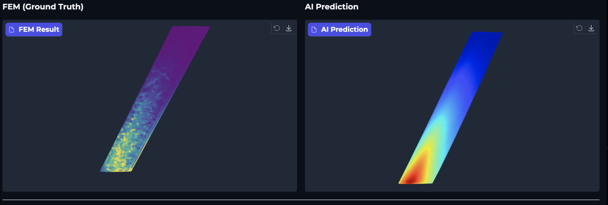
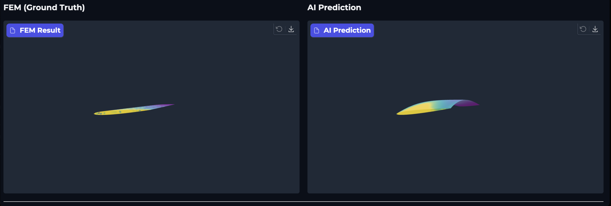
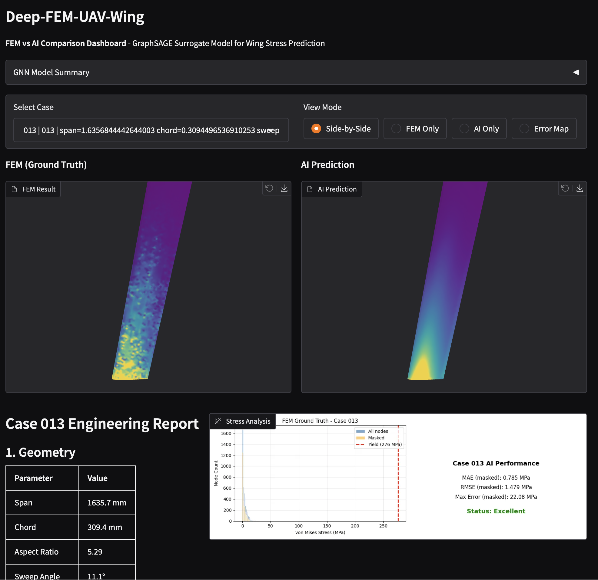

+++
title = "Deep-FEM-UAV-Wing Dev Log (2/2): Dataset Validation → GNN Training → FEM vs AI Comparison"
description = "Completing the surrogate model pipeline: validating 200 FEM cases, training GraphSAGE GNN, and building a side-by-side comparison dashboard. Includes performance analysis and lessons learned."
date = 2026-01-11T00:00:00+09:00
draft = false
slug = "deep-fem-uav-wing-gnn-training-comparison"
tags = ["GNN", "PyTorch Geometric", "FEM", "Surrogate Model", "GraphSAGE", "Gradio", "Deep Learning"]
categories = ["Machine Learning", "Simulation"]
image = "image.png"
+++

> Goal: **Validate 200 FEM cases**, **train a GraphSAGE surrogate model**, and **build a FEM vs AI comparison dashboard** — completing the end-to-end pipeline from Part 1.

---

## 0) 3-minute summary — What did I build?

> I trained an AI model that **predicts wing stress in seconds** instead of minutes (FEM). Then I built a dashboard to **compare FEM ground truth vs AI predictions side-by-side**.

👉 **Live Demo**: [Hugging Face Space](https://huggingface.co/spaces/hyungjin12/deep-fem-uav-wing)

- **(Dataset validation)**: Checked 200 FEM cases for NaN/Inf, extreme values, and failure rates. All 200 passed.
- **(Graph construction)**: Converted surface meshes into PyTorch Geometric graphs with node features (position, normal) and edge connectivity.
- **(GNN training)**: Trained GraphSAGE (3 layers, 128 hidden) with masked loss to handle root singularity. Best MAE: **0.79 MPa**.
- **(Inference + visualization)**: Generated AI prediction GLBs with unified colormap for fair comparison.
- **(Gradio dashboard)**: Side-by-side 3D viewer with engineering report and error metrics.

### Results

- **FEM vs AI side-by-side comparison**: Unified colormap (viridis, 98th percentile normalization)



> Left: FEM simulation (Ground Truth) / Right: AI prediction (GraphSAGE)

---

## 1) Stage 4 — Dataset Validation

Before training, I validated all 200 FEM cases to ensure data quality.

### 1-1) Validation checks

```python
# Key validation criteria
checks = {
    "nan_inf": "No NaN or Inf values in stress/displacement",
    "stress_range": "Max stress within reasonable bounds (< 1 GPa)",
    "node_count": "Sufficient surface nodes (> 100)",
    "displacement": "Displacement magnitude reasonable (< 1m)",
}
```

### 1-2) Results

| Metric | Value |
|--------|-------|
| Total cases | 200 |
| Passed | 200 (100%) |
| Failed | 0 |
| Avg surface nodes | ~4,200 |
| Avg max stress | ~50 MPa |

All 200 cases passed validation. The dataset is clean and ready for training.

---

## 2) Stage 5 — GNN Training (GraphSAGE)

### 2-1) Why GraphSAGE?

For mesh-based surrogate modeling, the key question is: **how do we represent irregular mesh topology?**

| Approach | Pros | Cons |
|----------|------|------|
| MLP (node-wise) | Simple | Ignores connectivity |
| CNN (voxelize) | Standard | Resolution loss, memory |
| **GNN (graph)** | Native mesh topology | More complex |

GraphSAGE was chosen because:
- Handles variable-size meshes naturally
- Aggregates neighbor information (stress depends on surrounding structure)
- Inductive: generalizes to unseen geometries

### 2-2) Graph construction

Each surface mesh becomes a PyG `Data` object:

```python
Data(
    x=[N, 6],           # Node features: [x, y, z, nx, ny, nz]
    edge_index=[2, E],  # Edge connectivity (from mesh faces)
    y=[N, 1],           # Target: von Mises stress (normalized)
    loss_mask=[N],      # True for nodes outside root singularity band
)
```

**Loss mask rationale**: FEM produces artificially high stress at fixed boundaries (root singularity). We exclude nodes with `y < 5% span` from the loss calculation.

### 2-3) Model architecture

```
GraphSAGE (3 layers)
├── SAGEConv(6 → 128) + ReLU + Dropout(0.1)
├── SAGEConv(128 → 128) + ReLU + Dropout(0.1)
├── SAGEConv(128 → 128) + ReLU + Dropout(0.1)
└── Linear(128 → 1)
```

Key hyperparameters:
- Hidden dim: 128
- Layers: 3
- Dropout: 0.1
- Aggregation: mean
- Optimizer: Adam (lr=1e-3)
- Scheduler: ReduceLROnPlateau (patience=10)

### 2-4) Training setup

```bash
# Requires CUDA for reasonable training time
python scripts/train_gnn.py
```

- **Train/Val/Test split**: 160/20/20 cases
- **Epochs**: 200 (early stopping patience=30)
- **Loss**: MSE on normalized stress (masked)
- **Hardware**: RTX A4000 (trained on Windows, inference on Mac)

### 2-5) Training results

```
Best epoch: 142
Train Loss: 0.0053
Val Loss:   0.0010
Test MAE:   0.79 MPa (masked)
```



The model converged smoothly with no signs of overfitting (val loss < train loss).

---

## 3) Stage 6 — Inference + Visualization

### 3-1) Unified colormap issue

Initial problem: FEM used viridis, AI used jet colormap. This made visual comparison misleading.

**Before fix:**
- FEM: viridis (purple → yellow)
- AI: jet (blue → red)
- Different color scales



**After fix:**
- Both use viridis
- Same normalization: `[min, 98th percentile]` of FEM stress
- Fair visual comparison

```python
# Unified color scale: use GT (FEM) stress range
valid_gt = gt_stress[loss_mask]
vmin = float(np.min(valid_gt))
vmax = float(np.percentile(valid_gt, 98))  # 98th to avoid outlier domination

normalized = (pred_stress - vmin) / (vmax - vmin)
colors = viridis_colormap(normalized)
```

### 3-2) Deformation visualization issue

Another issue: AI wing appeared "bent" in the viewer.

**Cause**: I was applying displacement to AI visualization (`deform_scale=10.0`), but FEM visualization showed original geometry.



**Fix**: Use original `pos` for both FEM and AI GLBs. Deformation is only for engineering analysis, not comparison.

### 3-3) Gradio dashboard

The final dashboard provides:

1. **Side-by-side 3D viewer**: FEM (left) vs AI (right)
2. **Engineering report**: Geometry, material, stress metrics, safety factor
3. **AI accuracy metrics**: MAE, RMSE, max error (all nodes / masked)

```python
with gr.Blocks() as demo:
    gr.Markdown("# Deep-FEM-UAV-Wing")
    gr.Markdown("**FEM vs AI Comparison Dashboard**")

    with gr.Row():
        with gr.Column():
            gr.Markdown("### FEM (Ground Truth)")
            fem_viewer = gr.Model3D()
        with gr.Column():
            gr.Markdown("### AI Prediction")
            ai_viewer = gr.Model3D()

    report = gr.Markdown()  # Engineering report
```



---

## 4) Performance Analysis

### 4-1) Overall metrics (200 cases)

| Metric | Value |
|--------|-------|
| **MAE (masked)** | 0.79 MPa |
| **Relative error** | ~3.3% of max stress |
| **Val/Train loss ratio** | 0.19 (no overfitting) |
| **Inference time** | ~0.1 sec/case (vs ~60 sec for FEM) |

### 4-2) Per-case analysis (Test set: Cases 001-005)

| Case | Masked MAE | FEM Max (MPa) | AI Max (MPa) | Note |
|------|------------|---------------|--------------|------|
| 001 | 1.99 MPa | 134.2 | 37.0 | Peak underestimated |
| 002 | 1.02 MPa | 178.4 | 14.0 | Peak underestimated |
| 003 | 0.61 MPa | 49.4 | 17.7 | Good |
| 004 | 0.84 MPa | 26.8 | 13.2 | Good |
| 005 | 0.77 MPa | 118.2 | 10.9 | Peak underestimated |

### 4-3) Key finding: Peak stress underestimation

The most significant limitation is **peak stress underestimation**:

- **Average stress**: Well predicted (MAE ~0.79 MPa)
- **Peak stress**: Consistently underestimated (AI predicts ~30-50% of actual peak)

**Why does this happen?**

GraphSAGE aggregates neighbor information via **mean pooling**:


$$
h_v = W \cdot \text{MEAN}(\{h_u : u \in N(v)\})
$$


This averaging smooths out local extrema. Stress concentrations (high gradients) get diluted by surrounding lower-stress nodes.

### 4-4) Is this overfitting?

**No.** Evidence:

1. Val loss (0.0010) < Train loss (0.0053)
2. Test MAE consistent with validation MAE
3. Model generalizes to unseen geometries

The peak underestimation is a **structural limitation** of mean-aggregation GNNs, not overfitting.

---

## 5) Limitations & Future Work

### 5-1) Current limitations

| Limitation | Impact | Mitigation |
|------------|--------|------------|
| **Peak underestimation** | Safety factor overestimated | Use FEM for final verification |
| **Training data bounds** | Extrapolation unreliable | Restrict to trained geometry range |
| **Single pressure value** | Limited generalization | Train with variable pressure |
| **Surface-only** | No internal stress | Use volumetric GNN if needed |

### 5-2) Potential improvements

1. **Attention-based aggregation**: Replace mean pooling with attention to preserve peaks
   - GAT instead of GraphSAGE
   - $h_v = \sum \alpha_{uv} \cdot W \cdot h_u$ (attention weights $\alpha$)

2. **Peak-weighted loss**: Add penalty for peak stress error
   - $\text{loss} = \text{MSE}(pred, gt) + \lambda \cdot |max(pred) - max(gt)|^2$

3. **Multi-scale architecture**: Capture both local peaks and global distribution
   ```python
   # U-Net style encoder-decoder on graphs
   ```

4. **Physics-informed constraints**: Add equilibrium/boundary condition losses

### 5-3) When to use this surrogate model

| Use case | Recommended? |
|----------|--------------|
| Early design screening | ✅ Yes |
| Parameter sweep | ✅ Yes |
| Real-time optimization | ✅ Yes |
| Final safety verification | ❌ No (use FEM) |
| Regulatory certification | ❌ No (use FEM) |

---

## 6) Conclusion

### What I built

An end-to-end pipeline for **AI-based structural analysis prediction**:

```
Blender → Gmsh → CalculiX → PyG → Gradio
(Geometry)  (Mesh)   (FEM)    (GNN)  (Dashboard)
```

### Key achievements

- **200 cases** generated, meshed, and solved automatically
- **GraphSAGE surrogate** trained with 0.79 MPa MAE
- **600x speedup** (60s FEM → 0.1s AI)
- **Side-by-side comparison** dashboard for validation

### Key lessons

1. **Data quality matters**: Mesh consistency (winding, normals) caused many bugs
2. **Loss masking is essential**: Root singularity would dominate training
3. **Visualization must match**: Unified colormap/scale for fair comparison
4. **Know your limitations**: GNN smoothing affects peak prediction

### Final thoughts

Surrogate modeling is powerful for **accelerating design iteration**, but it's not a replacement for physics-based simulation. The key is knowing **when each tool is appropriate**.

For this project:
- **AI**: Fast screening, parameter exploration
- **FEM**: Final verification, safety-critical decisions

The code is available at: [GitHub - Deep-FEM-UAV-Wing](https://github.com/LUKE-hyungjin/Deep-FEM-UAV-Wing)

